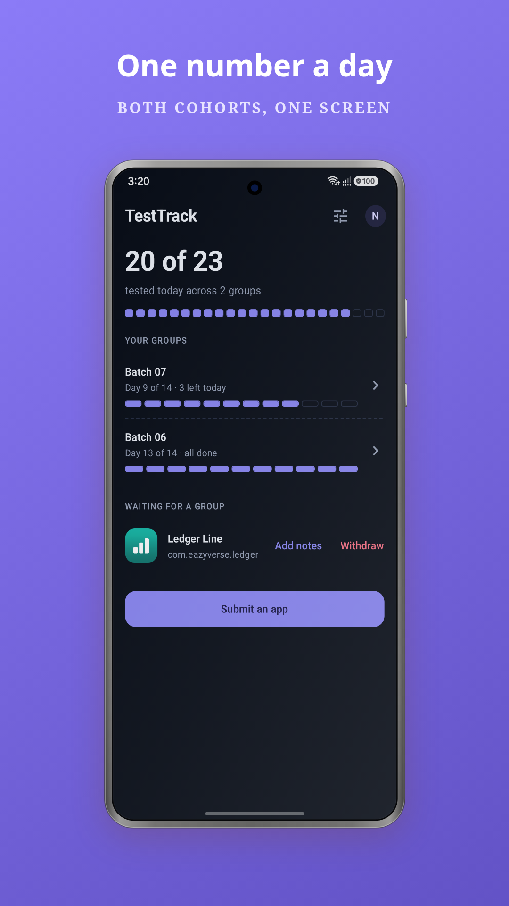
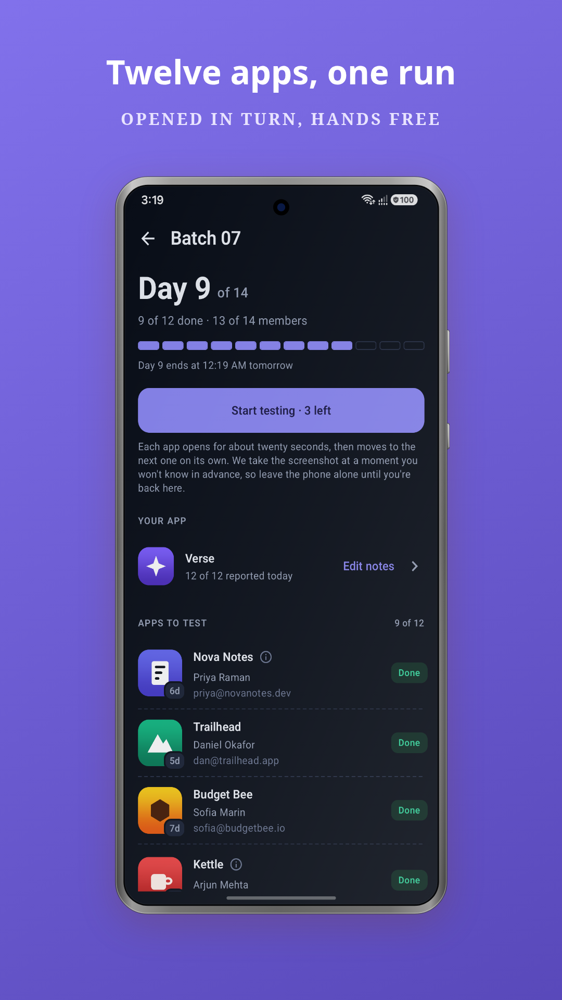
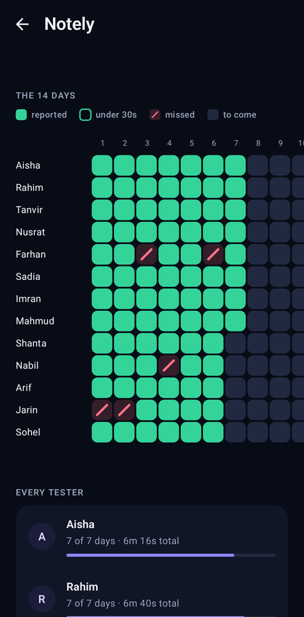
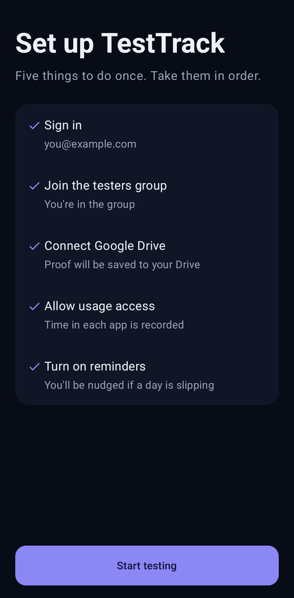

# TestTrack

TestTrack helps a group of Android developers get each other's apps through Google Play's
closed-testing requirement, without anyone having to chase screenshots in a WhatsApp thread.

A new personal Play developer account needs [12 testers opted in for 14 continuous days](https://support.google.com/googleplay/android-developer/answer/14151465)
before it can apply for production access. Finding 12 people willing to keep an app installed for a
fortnight is hard alone, so developers form groups and test each other's apps. TestTrack is the
place that group keeps score: you open the apps, the app records that you did, and every owner can
see their own 14-day grid.

> **বাংলায়:** নতুন পার্সোনাল Play ডেভেলপার অ্যাকাউন্ট প্রোডাকশনে নিতে হলে ১২ জন টেস্টার লাগে, আর
> তাদের টানা ১৪ দিন অ্যাপটা ফোনে রাখতে হয়। একা এতজন জোগাড় করা রীতিমতো ঝামেলা। তাই ডেভেলপাররা দল
> বেঁধে একে অন্যের অ্যাপ টেস্ট করেন। TestTrack ওই হিসাবটাই রাখে, যাতে গ্রুপে স্ক্রিনশট চেয়ে চেয়ে
> দিন পার করতে না হয়।


Your cohorts and what today still owes, a day's worklist with the one button that walks it, the
fourteen days of who turned up, and the setup you do once.

<p align="center">
  
  
</p>
<p align="center">
  
  
</p>

## Joining

1. **Join the testers group.** Every cohort is drawn from
   [googleclosetesting](https://groups.google.com/g/googleclosetesting). Play requires the list, and
   TestTrack confirms your membership on Google's servers rather than taking the phone's word for
   it.
2. **Install TestTrack** from the [releases page](https://github.com/almasumdev/testtrack/releases).
   Sign in with the same account you joined the group with.
3. **Submit your app.** An administrator places it into a cohort, and the fourteen days start once
   thirteen apps are in. From then it is a few minutes a day.

It costs nothing, and there is nothing to buy.

> **বাংলায়:** শুরু করতে তিনটা ধাপ।
>
> ১) [googleclosetesting](https://groups.google.com/g/googleclosetesting) গ্রুপে জয়েন করুন, সব
> কোহর্ট এখান থেকেই বানানো হয়। Play এই লিস্টটা চায়, আর TestTrack আপনার সদস্যপদ Google এর
> সার্ভারে গিয়ে মিলিয়ে দেখে, ফোনের কথায় বিশ্বাস করে না।
>
> ২) [রিলিজ পেজ](https://github.com/almasumdev/testtrack/releases) থেকে অ্যাপটা ইনস্টল করুন, আর যে
> অ্যাকাউন্ট দিয়ে গ্রুপে ঢুকেছেন সেটা দিয়েই সাইন ইন করুন।
>
> ৩) নিজের অ্যাপ সাবমিট করুন। অ্যাডমিন সেটাকে একটা কোহর্টে বসাবেন, আর তেরোটা অ্যাপ হলেই চৌদ্দ দিনের
> গণনা শুরু। এরপর দিনে কয়েক মিনিটের ব্যাপার।
>
> কোনো খরচ নেই, কেনার মতো কিছুও নেই।

---

# Before you install

You are about to give an app permission to see how long other apps stay on your screen, and to
take a screenshot while one of them is open. Those are serious permissions and you are right to
stop and ask what happens to them. This section answers that before anything else, in as much
detail as it takes.

Every claim below can be checked against the source in this repository. Where a file settles the
question, it is linked.

> **বাংলায়:** এই অ্যাপ দুটো বড় পারমিশন চায়। এক, কোন অ্যাপ কতক্ষণ স্ক্রিনে ছিল সেটা দেখা। দুই,
> টেস্ট চলার সময় স্ক্রিনশট নেওয়া।
>
> শুনে খটকা লাগলে সেটাই স্বাভাবিক, আর না বুঝে ইনস্টল না করাই ভালো। তাই নিচে একটা একটা করে বলা আছে,
> কোনটা কেন লাগে আর সেটা দিয়ে ঠিক কী করা হয়। যা যা বলা হয়েছে, সবই এই রিপোর কোড খুলে মিলিয়ে নিতে
> পারবেন।

## The short version

| What it asks for | What it actually does | What it never does |
|---|---|---|
| Usage access | Reads how many seconds one named app was on screen during the visit | Read what you did inside any app, or when |
| Screen capture | One screenshot per app, only during a round you started | Run in the background or record video |
| Google Drive | Writes your screenshots to a folder it creates | Touch anything else in your Drive |
| Crash reports | Sends the stack trace when something breaks | Say who it broke for |
| Counts | Four numbers: a round started, a round finished, a proof posted, an app submitted | Name an app, a person, or a time |
| Google sign-in | Your email and name, so a grid can show who is who | Ask for or see your password |
| Notifications | A reminder from your own phone in the evening | Anything, if you decline. It is optional |

TestTrack does not request contacts, messages, photos, location, microphone, camera, or call log.
It declares seven permissions in total, all of them at the top of
[app/src/main/AndroidManifest.xml](app/src/main/AndroidManifest.xml), each with a comment saying
why it is there. Nothing can be added to that list without you seeing it on the next install.

There is no analytics SDK, no crash reporter, no advertising library, and no third-party tracker
anywhere in the build. Every library the app ships with is listed in
[app/build.gradle.kts](app/build.gradle.kts), and the only network services among them are Google
sign-in, Firebase, and Google Drive.

---

## Usage access, the one that worries people most

**Why it is needed.** Play does not count an app being launched. It counts an app being used. So a
screenshot is not enough on its own: a screenshot proves the app opened, and nothing more. The
daily record carries real foreground time, and there is no way to measure that from inside
TestTrack, because TestTrack can only time the visit it started itself. That is exactly the number
a person could fake by opening an app and walking away.

**What Android hands over.** Be clear about this, because a half-answer here is worse than none.
When TestTrack asks the system what happened during a visit, Android returns a stream covering
every app on the phone for that window. That is how the API works, and no app can ask for a
narrower slice.

**What TestTrack does with it.** It walks that stream and keeps one number: the seconds spent in
the single package it is checking, which is one of the apps in your group. Every other event is
skipped on the spot. Nothing about any other app is stored, remembered, or sent anywhere. The
whole function is about forty lines and you can read it in
[UsageRepo.kt](app/src/main/java/com/eazyverse/testtrack/data/UsageRepo.kt); the line that does the
discarding is `if (event.packageName != pkg) continue`. The numbers come from Android's
[UsageStatsManager](https://developer.android.com/reference/android/app/usage/UsageStatsManager), which is
the only source of them there is.

**What leaves your phone.** One integer per app per day, the milliseconds that app was on screen
during the visit. That is the entire upload. Not app names you use, not a timeline, not a browsing
history.

**It is not silent.** Usage access cannot be granted by a popup.
[PACKAGE_USAGE_STATS](https://developer.android.com/reference/android/Manifest.permission#PACKAGE_USAGE_STATS)
is not that kind of permission. You have to walk into Settings, into Special access, and switch it
on yourself, and you can switch it off in the same place at any
moment. TestTrack cannot turn it on, and cannot keep it on.

> **বাংলায়:** Play শুধু অ্যাপ খোলা হয়েছে কিনা দেখে না, কতক্ষণ চালানো হয়েছে সেটাও দেখে। তাই শুধু
> স্ক্রিনশটে কাজ হয় না, কত সেকেন্ড স্ক্রিনে ছিল সেটাও লাগে।
>
> এবার আসল জায়গাটা বলি, কারণ আধাআধি বললে সন্দেহ বরং বাড়ে। Android কে আজকের হিসাব জিজ্ঞেস করলে সে
> ফোনের সব অ্যাপের হিসাব একসাথে ধরিয়ে দেয়। এটা সিস্টেমের নিয়ম, এর চেয়ে ছোট অংশ কোনো অ্যাপ চাইতেই
> পারে না।
>
> TestTrack ওই লিস্ট থেকে একটা সংখ্যাই নেয়, গ্রুপের যে অ্যাপটা চেক করছে সেটা কত সেকেন্ড স্ক্রিনে
> ছিল। বাকি সব ওখানেই বাদ। অন্য কোনো অ্যাপের কথা কোথাও জমা হয় না, কোথাও যায়ও না।
>
> সার্ভারে যায় ওই একটা সংখ্যা। আপনি কোন অ্যাপে কী করলেন, কী দেখলেন, সেসবের কিছুই না।
>
> আরেকটা কথা, এই পারমিশন চুপিচুপি নেওয়ার উপায় নেই। নিজে Settings এ ঢুকে Special access থেকে অন
> করতে হবে, আর যখন খুশি ওখান থেকেই অফ করে দিতে পারবেন। অ্যাপ নিজে থেকে এটা অন করতেও পারে না, অন
> রাখতেও পারে না।

## The screenshot

**When it happens.** Only during a round that you start by pressing the button yourself. Android
asks you to confirm screen sharing, and while the round runs it shows its own indicator that no
app can hide. When the round ends, the capture stops. The mechanism is Android's
[MediaProjection](https://developer.android.com/media/grow/media-projection), and the consent prompt
and the indicator are its rules rather than ours.

**Why the moment is unannounced.** The shot lands at a random point inside each visit rather than
at a fixed second. If it were predictable, opening an app and waiting for the flash would be
enough to pass, which would make the whole record worth nothing to the group depending on it.

**What is in the frame, and this one deserves care.** Screen capture takes the screen, not the
app. Whatever is on display at that instant is in the picture, including a notification banner
that happens to slide down at the wrong moment. Turn on Do Not Disturb before a round if that
matters to you. It is a good habit regardless.

**Where it goes.** Into your own Google Drive, in a folder called `TestTrack Proofs` that the app
creates. The file is yours. It is in your Drive, it counts against your storage, and you can open
that folder and delete anything in it whenever you like.

**Read this part twice.** So the developer whose app you tested can actually see the proof, the
file is then set to "anyone with the link can view". It is not listed anywhere, not searchable,
and not indexed, but it is not private either: anybody who obtains that link can open the picture.
In practice the link is written into one database record readable by you, that app's owner, and an
administrator. Still, treat every proof screenshot as something that could be seen, and keep
private things off your screen while a round runs.

> **বাংলায়:** স্ক্রিনশট তখনই ওঠে যখন আপনি নিজে রাউন্ড শুরু করেন। Android একবার কনফার্ম করতে বলে,
> আর রাউন্ড চলার পুরো সময় স্ক্রিনে সিস্টেমের নিজের চিহ্নটা থাকে, যেটা কোনো অ্যাপ লুকাতে পারে না।
>
> ছবিটা ঠিক কখন উঠবে সেটা বলা হয় না, ইচ্ছে করেই। আগে থেকে জানা থাকলে অ্যাপ খুলে ঝলকটা দেখে বেরিয়ে
> গেলেই কাজ হয়ে যেত, আর তাহলে গ্রুপের কাছে এই প্রমাণের কোনো দামই থাকত না।
>
> **এই জায়গাটা একটু খেয়াল করবেন:** স্ক্রিন ক্যাপচার পুরো স্ক্রিনের ছবি নেয়, শুধু ওই অ্যাপের না।
> ওই মুহূর্তে স্ক্রিনে যা আছে সব ছবিতে চলে আসে, হুট করে নেমে আসা নোটিফিকেশনসহ। রাউন্ড শুরুর আগে Do
> Not Disturb অন করে নিলে এই ঝামেলাটা আর থাকে না।
>
> ছবিগুলো জমা হয় আপনার নিজের Google Drive এ, `TestTrack Proofs` ফোল্ডারে। ফাইলগুলো আপনার, যখন খুশি
> মুছে দিতে পারেন।
>
> **আর এটা জেনে রাখা দরকার:** যার অ্যাপ টেস্ট করলেন সে যাতে প্রমাণটা দেখতে পারে, তাই ফাইলটা "লিংক
> থাকলে দেখা যাবে" করে দেওয়া হয়। কোথাও লিস্ট হয় না, সার্চেও আসে না, কিন্তু পুরোপুরি প্রাইভেটও না।
> লিংক হাতে পেলে যে কেউ ছবিটা খুলতে পারবে। তাই রাউন্ড চলার সময় স্ক্রিনে ব্যক্তিগত কিছু না রাখাই
> ভালো।

## Google Drive access

TestTrack asks for [`drive.file`](https://developers.google.com/workspace/drive/api/guides/api-specific-auth), which is
the narrowest Drive permission Google publishes, and the one Google itself classifies as
non-sensitive. It grants access to files this app itself created, and to nothing else. Not your documents, not your
photos, not your backups, not a file some other app put there.

This is not a promise the app is making. It is a boundary Google enforces on its own servers. Even
if TestTrack asked for one of your other files, the request would be refused. The scope is one
line, in [Config.kt](app/src/main/java/com/eazyverse/testtrack/Config.kt), and the comment beside
it says not to widen it.

You can withdraw the access at any time from
[your Google account's third-party access page](https://myaccount.google.com/permissions), without
uninstalling anything. Google explains the procedure
[here](https://support.google.com/accounts/answer/13533235).

> **বাংলায়:** TestTrack Drive এর সবচেয়ে ছোট পারমিশনটা চায়, `drive.file`। এটা দিয়ে শুধু এই অ্যাপ
> নিজে যেসব ফাইল বানিয়েছে সেগুলোতেই হাত দেওয়া যায়। আপনার ডকুমেন্ট, ছবি, ব্যাকআপ, অন্য অ্যাপের রাখা
> ফাইল, কোনোটাতেই না।
>
> এটা অ্যাপের মুখের কথা না, সীমাটা Google নিজে তার সার্ভারে টেনে রাখে। TestTrack চাইলেও আপনার অন্য
> ফাইল পাবে না, রিকোয়েস্টটাই আটকে যাবে। আর মন চাইলে Google অ্যাকাউন্টের সিকিউরিটি পেজ থেকে যেকোনো
> সময় এই অ্যাক্সেস তুলে নিতে পারেন, অ্যাপ আনইনস্টল করা লাগবে না।

## Seeing the apps in your group

TestTrack needs to know whether you have installed the apps you are meant to be testing, and it
needs their icons and names to show you a list worth reading.

It does this by asking Android about one specific package name at a time, the ones in your cohort.
It never asks the system for a list of what you have installed, and it holds no permission that
would let it. What it learns about each of those named packages is: whether it is installed, when
it was first installed, which store installed it, its name, and its icon. See
[InstalledApps.kt](app/src/main/java/com/eazyverse/testtrack/data/InstalledApps.kt).

The manifest deliberately does not hold [`QUERY_ALL_PACKAGES`](https://support.google.com/googleplay/android-developer/answer/10158779),
the permission that would reveal everything on the phone. Play restricts it to a short list of app
types that TestTrack is not one of, so dropping it is also what keeps TestTrack eligible. What it
uses instead is ordinary
[package visibility](https://developer.android.com/training/package-visibility).

> **বাংলায়:** আপনার গ্রুপের অ্যাপগুলো ইনস্টল আছে কিনা, আর লিস্টে দেখানোর জন্য সেগুলোর নাম আর আইকন,
> TestTrack এইটুকুই জানে। সে একটা একটা করে নির্দিষ্ট প্যাকেজের নাম ধরে জিজ্ঞেস করে। আপনার ফোনে কী কী
> অ্যাপ আছে তার লিস্ট সে কখনো চায় না, চাওয়ার মতো পারমিশনও তার নেই। যেটা দিয়ে পুরো লিস্ট দেখা যেত,
> `QUERY_ALL_PACKAGES`, সেটা ইচ্ছে করেই রাখা হয়নি।

## Notifications

The only optional permission. TestTrack posts a reminder in the evening if you still owe the group
apps for the day, and raises a notice if something happened to your app while you were away.

These are raised by your own phone, from data it already has, not sent from a server. Decline the
permission and every other part of the app works exactly the same; you simply have to remember on
your own. Setup finishes either way, though it will ask once.

> **বাংলায়:** একমাত্র এই পারমিশনটা না দিলেও চলে। সন্ধ্যায় আজকের বাকি কাজ মনে করিয়ে দেওয়া, আর
> আপনার অ্যাপের কিছু হলে জানানো, কাজ এইটুকুই।
>
> খেয়াল রাখবেন, এই নোটিফিকেশনগুলো আপনার ফোন নিজেই বানায়, সার্ভার থেকে পাঠানো হয় না। না দিলে অ্যাপের
> বাকি সব আগের মতোই চলবে, শুধু কী বাকি আছে সেটা নিজেকে মনে রাখতে হবে।

---

## Who can see what about you

| Thing | Who can read it |
|---|---|
| Your screenshot and your daily time | You, the owner of the app you tested, and an administrator |
| Your name and email | Any signed-in TestTrack account |
| Which groups you are in, how each run ended | You and an administrator |
| Your Drive folder | You, plus anyone holding a proof link |

The second row is the one to be straight about. Your display name and email address are readable
by any signed-in account. That is deliberate: a grid has to turn an account id into a human name,
and there is no way to do that without the name being readable. What is exposed is an address and
a name, nothing else. Your proofs, your times, and your history are not part of it.

Your proofs are narrower than people usually assume. A proof document can be read by the person
who made it, the developer who owns the app it is about, and an administrator. Not by the rest of
the group. The rules that enforce this are in [firestore.rules](firestore.rules) and every refusal
in them is covered by a test in [firestore-tests/](firestore-tests/), so they are checked rather
than asserted.

> **বাংলায়:** আপনার স্ক্রিনশট আর সময়ের হিসাব দেখতে পায় তিনজন, আপনি নিজে, যার অ্যাপ টেস্ট করেছেন,
> আর অ্যাডমিন। গ্রুপের বাকিরা না।
>
> তবে একটা জিনিস পরিষ্কার করে বলে রাখি। আপনার নাম আর ইমেইল সাইন ইন করা যেকোনো অ্যাকাউন্ট দেখতে পারে।
> এটা ইচ্ছে করেই রাখা, কারণ লিস্টে আইডির বদলে মানুষের নাম দেখাতে হলে নামটা পড়তে পারা লাগবেই। এর
> বাইরে আর কিছু না, আপনার প্রমাণ, সময় বা ইতিহাস এর মধ্যে পড়ে না।

## Your record stays

Nothing in TestTrack is deleted on a timer. Every run you finish, every removal, and every
submission that was turned down stays on your record permanently.

This is a deliberate choice and it cuts both ways, so it is worth saying plainly. A group is about
to trust a stranger with fourteen days of their own deadline, and the only thing that makes that
reasonable is being able to see how that person has behaved before. The same record that shows a
removal also shows every run you completed, and a long clean history is the thing that gets you
into good groups quickly.

When an administrator opens your profile they see: the cohorts you have been in, how each one
ended, the share of days you actually covered, and any app of yours that was turned down along
with the reason. They can pause an account, and if they do, you are told and you are told why.

> **বাংলায়:** এখানে কিছুই সময় পেরোলে মুছে যায় না। আপনার শেষ করা প্রতিটা রান, প্রতিটা বাদ পড়া, আর
> ফিরিয়ে দেওয়া প্রতিটা সাবমিশন রেকর্ডে থেকে যায়।
>
> এটা ইচ্ছে করেই, আর কাজটা দুই দিকেই হয়। একটা গ্রুপ অচেনা একজনকে নিজেদের চৌদ্দ দিন ভরসা করে দিচ্ছে,
> আগের আচরণ দেখতে না পারলে ওটা অন্ধ ভরসা ছাড়া কিছু না। আবার যে রেকর্ডে বাদ পড়াটা দেখা যায়, সেই
> রেকর্ডেই আপনার শেষ করা সব রান দেখা যায়। পরিষ্কার একটা ইতিহাস থাকলে ভালো গ্রুপে জায়গা পেতে দেরি
> হয় না।
>
> অ্যাডমিন আপনার প্রোফাইলে দেখেন, কোন কোন গ্রুপে ছিলেন, কোনটা কীভাবে শেষ হলো, কত দিন আপনি সত্যিই
> কভার করেছেন, আর কোনো অ্যাপ ফিরিয়ে দেওয়া হয়ে থাকলে সেটা কেন। অ্যাডমিন চাইলে অ্যাকাউন্ট আটকে দিতে
> পারেন, আর দিলে আপনাকে কারণসহ জানানো হয়।

## Crash reports and counts

Two things now report back, both from Firebase, and both off entirely in the builds made on this
machine.

**Crashes.** Nearly every failure in a round is caught and turned into a sentence you can act on.
That is right for the person it happens to and it means nobody else ever finds out. A crash that
only happened on landscape apps survived a whole release that way: the only person who could see
it was the tester it happened to, and they had no way to send it anywhere. Crash reports are how
that stops. What goes with one is the stack trace and a fixed word naming the place it came from,
never a message, a value, a package name, or anything about you.

**Counts.** Four events, and they are the whole list: a round started, a round finished with how
many were captured and how many were missed, a proof posted, an app submitted. Numbers only. A run
of rounds ending with misses is the shape a real bug made once and it was invisible from outside
the phone it happened on.

Neither carries a uid, an address, a name, or the identity of any app you are testing. What they
cannot do is more useful than what they can: nothing here can reconstruct who tested what, or
when.

## Where to get it, and what happens on an update

Every build is published as a signed APK on the
[releases page](https://github.com/almasumdev/testtrack/releases). Take the newest one.

Updates install straight over the top. You do not uninstall first, you do not lose your setup, and
you do not sign in again. Every release is signed with the same key, which is what allows that.

Where TestTrack came from Play, it will also offer the update itself, and take it in the
background rather than sending you anywhere. That exists for a reason worth stating plainly: the
rules of a run ship inside the app, so a cohort where everyone is on a different build is a cohort
where the same day looks different to different people. One tester's screen called a visit short
for two days after that stopped being the rule, because their copy still held the old one. Where a
build no longer counts a day the way its cohort does, the app says so and asks to be updated
before you carry on.
The same fact has a consequence worth knowing: a TestTrack APK from anywhere other than that page
will refuse to install over yours. That refusal is the check doing its job, not a fault to work
around.

> **বাংলায়:** প্রতিটা বিল্ড সাইন করা APK হিসেবে
> [রিলিজ পেজে](https://github.com/almasumdev/testtrack/releases) থাকে, সেখান থেকে সবচেয়ে নতুনটা
> নামিয়ে নিন।
>
> আপডেট আগেরটার উপরেই বসে যায়। আনইনস্টল করা লাগে না, সেটআপ হারায় না, আবার সাইন ইনও করতে হয় না,
> কারণ প্রতিটা রিলিজ একই কী দিয়ে সাইন করা।
>
> এর আরেকটা দিক আছে। ওই পেজ ছাড়া অন্য কোথাও থেকে পাওয়া TestTrack এর APK আপনার ইনস্টল করা কপির
> উপরে বসবে না। এটা সমস্যা না, এটাই সুরক্ষাটা কাজ করার লক্ষণ।

## If usage access will not switch on

On some phones the usage access toggle is visible but refuses to move. Nothing is broken and it is
not something TestTrack can fix from inside the app, so here is what is happening.

Since Android 15, a protection called
[Enhanced Confirmation Mode](https://developer.android.com/about/versions/15/behavior-changes-all)
blocks that setting for any app that arrived through a browser or a file manager. Apps that came
from Play are not affected.

To clear it: open App info for TestTrack, tap the three-dot menu in the corner, and choose
*Allow restricted settings*. That entry only appears after you have tried the blocked toggle once,
so tap the toggle first if you do not see it. Then switch usage access on as normal.

> **বাংলায়:** কোনো কোনো ফোনে usage access এর টগলটা চোখে দেখা যায় কিন্তু নড়ে না। কিছু নষ্ট হয়নি,
> আর অ্যাপের ভেতর থেকে এটা ঠিক করারও উপায় নেই, তাই ব্যাপারটা বলে রাখি।
>
> Android 15 থেকে Enhanced Confirmation Mode নামে একটা সুরক্ষা এসেছে, যেটা ব্রাউজার বা ফাইল
> ম্যানেজার দিয়ে আসা অ্যাপের জন্য ওই সেটিংটা আটকে রাখে। Play থেকে আসা অ্যাপে এই বাধা নেই।
>
> ঠিক করতে হলে TestTrack এর App info খুলুন, কোনার তিন ডটের মেনুতে চাপ দিন, তারপর *Allow restricted
> settings* বেছে নিন। অপশনটা তখনই আসে যখন একবার আটকে থাকা টগলটাতে চাপ দেওয়া হয়েছে, তাই না দেখলে
> আগে টগলে একবার চাপ দিন। এরপর স্বাভাবিকভাবেই usage access অন করতে পারবেন।

## What TestTrack never does

- It never reads your messages, contacts, photos, location, or call history. It does not hold the
  permissions that would allow any of it.
- It never takes a screenshot outside a round you started, and Android shows its own indicator the
  whole time one is running.
- It never asks for your Google password. Sign-in happens on Google's own screen and the app only
  receives a token afterwards.
- It never asks for money and never shows an advert.
- It never uploads anything about apps outside your group.
- It never sends anything that identifies you to a crash report or a count. See below for exactly
  what those two do send.

---

# How it works day to day

## Groups

Testing happens in **cohorts of 14**, one app per member.

Twelve is the number Google asks for, but it does not count an app's own developer, so a cohort of
twelve leaves every app one tester short. Fourteen members gives each app twelve or thirteen
testers with a slot of margin, and the run only starts once **thirteen** have been placed, because
below that Play Console is not counting either.

The run belongs to the group, not to the app. Every app in a cohort is on the same day, which is
what lets it be read as a cohort at all. Submitting an app registers it; an **admin approves it by
placing it in a group**, and those are the same act. There is no approved-but-unassigned state.

If a member drops out mid-run the day count **keeps going**. Play Console will have reset its own,
so the group screen says so outright rather than letting a grid that reads "day nine" imply
otherwise.

## Setting up, once

Five steps, and the last one is optional:

1. Sign in with Google
2. Join the testers group
3. Connect Google Drive
4. Allow usage access
5. Turn on reminders

## A day

1. Open TestTrack and press **Start testing**.
2. Confirm screen sharing once. The round covers the whole group under that single confirmation.
3. Each app opens in turn, is held for 20 seconds, is screenshotted at an unannounced moment, and
   hands straight over to the next one. You do not press anything in between.
4. You land back in TestTrack, and every proof uploads to your Drive.

A single **Open** on any row runs a round of one, so both paths behave identically.

**A day needs 10 seconds of use, not a launch.** The visit is held for 20 seconds to clear a
10-second bar, and the gap between the two is doing two jobs. The clock starts when the service
schedules the visit while usage only accrues once the app has reached the foreground a second or
two later, so a visit measured at exactly the bar comes back a shade under it and fails the rule
it satisfied. The larger reason is the screenshot: it lands somewhere between 10 and 17 seconds,
because a WebView wrapper can still be showing its logo at eight, and a shorter visit would
photograph splash screens.

Foreground time is measured across the visit itself, not the calendar day. It used to be the day,
and at a lower bar that stopped being honest: one long session earlier the same day cleared the
bar before the visit even began, and the visit then proved nothing the screenshot had not.

Owners get a dashboard per app: how many of the thirteen reported today with their screenshots and
times, the 14-day grid, who is still to report, and a per-tester breakdown.

## The rules, and who enforces them

Miss one completed day and you get a warning. Miss two completed days in a row and your app leaves
the group.

Four things keep that fair, and each one matters:

- **Only completed days are judged.** Today never counts against you, because the apps are still
  openable and you have not missed anything yet.
- **Days before you joined never count.** An app placed into a group on day nine is judged from
  day nine.
- **You are told which apps, by name.** "You missed three" only invites a guess about which three.
- **A warning comes before a removal, always.** Nobody is removed without having been told first,
  on the day in between.

Fourteen days is the default rather than a ceiling. An admin can extend a run when a group needs
longer, and after day fourteen nothing happens on its own: the run carries on the same way, and
updates become optional rather than required unless the admin extends.

**Who does the removing.** There is no server watching. Each member's phone checks the attendance
of the app that member owns, using proof records it is already allowed to read, and acts on what
it finds. Thirteen apps means thirteen phones each watching their own, and between them nobody
goes unwatched.

This sounds like it could be abused, so here is why it cannot. Every removal is re-checked by the
database itself before it is accepted. The security rules recount the missed days from the actual
proof documents, and a modified copy of the app that tried to remove somebody who was present
would simply be refused. The enforcement is in
[Enforcement.kt](app/src/main/java/com/eazyverse/testtrack/data/Enforcement.kt), the check that
overrules it is in [firestore.rules](firestore.rules), and the tests that hold it to that are in
[firestore-tests/](firestore-tests/).

The honest cost of having no server is timing: nothing happens while every phone in a cohort is
shut. That is the harmless direction for the failure to go, since a cohort where nobody opens the
app has already stopped working for other reasons.

> **বাংলায়:** শেষ হওয়া একটা দিন মিস করলে ওয়ার্নিং, পরপর দুই দিন মিস করলে আপনার অ্যাপ গ্রুপ থেকে
> বাদ পড়ে।
>
> চারটা জিনিস এটাকে ঠিক জায়গায় রাখে। আজকের দিনটা কখনো আপনার বিপক্ষে যায় না, দিন শেষ না হলে কিছু
> মিস হয়েছে বলার সুযোগই নেই। গ্রুপে ঢোকার আগের দিনগুলোও গোনা হয় না। কোন কোন অ্যাপ বাকি, নাম ধরে
> বলা হয়। আর বাদ পড়ার আগের দিন ওয়ার্নিং যায়, না জানিয়ে কাউকে বাদ দেওয়া হয় না।
>
> **বাদ দেয় কে:** কোনো সার্ভার বসে বসে পাহারা দিচ্ছে না। প্রত্যেক সদস্যের ফোন শুধু তার নিজের
> অ্যাপের হাজিরাটা দেখে, যেটা দেখার পারমিশন তার আগে থেকেই আছে। তেরোটা অ্যাপ মানে তেরোটা ফোন,
> প্রত্যেকে নিজেরটা দেখছে, ফলে কেউ নজরের বাইরে থাকে না।
>
> এখানে কারচুপির ভয় আসতে পারে, তাই বলে রাখি কেন সেটা হবে না। বাদ দেওয়ার হিসাবটা ডেটাবেজ নিজে আবার
> মিলিয়ে দেখে, আসল প্রমাণের রেকর্ড থেকে গুনে। কেউ অ্যাপ বদলে হাজির থাকা কাউকে বাদ দিতে চাইলে
> ডেটাবেজ ওটা সোজা বাতিল করে দেয়।

---

# Checking any of this for yourself

Nothing above asks to be taken on trust. Every claim is answerable from the source, and these are
the files that answer the ones worth asking.

| Question | Where it is settled |
|---|---|
| What permissions does it hold? | [AndroidManifest.xml](app/src/main/AndroidManifest.xml), seven of them, each with its reason |
| What does it do with usage access? | [UsageRepo.kt](app/src/main/java/com/eazyverse/testtrack/data/UsageRepo.kt) |
| Does it list my installed apps? | [InstalledApps.kt](app/src/main/java/com/eazyverse/testtrack/data/InstalledApps.kt), one named package at a time |
| How much of my Drive can it reach? | [Config.kt](app/src/main/java/com/eazyverse/testtrack/Config.kt), one line |
| Who can read my proofs? | [firestore.rules](firestore.rules) |
| Are those limits actually enforced? | [firestore-tests/](firestore-tests/) |
| What libraries ship in the app? | [app/build.gradle.kts](app/build.gradle.kts) |

The rules are the part that is easy to assert and hard to verify, so the refusals are tested rather
than promised. A tester cannot create a group, cannot start their own clock, cannot place their own
app, cannot read a stranger's proof, cannot read another device's push token, cannot unblock
themselves, and cannot remove a member who actually turned up.

```bash
cd firestore-tests && npm install && npm test
```

You can also build the app yourself instead of trusting the published APK. It needs Android Studio,
and `local.properties.example` lists the four values to fill in.

```bash
git clone https://github.com/almasumdev/testtrack.git
cd testtrack
cp local.properties.example local.properties
./gradlew assembleDebug
```

## Two things it deliberately does not ask for

These are worth saying because they cost the app something, and the cheaper choice was available.

**Full control of your device.** An accessibility service that scrolled and tapped inside each app
was built and then removed. It worked. It also cost every tester a *"full control of your device"*
grant, which Android revokes on every reinstall, and it bought one extra page of proof. That is
not a fair trade to ask thirteen people to make.

**Access to your Play Console.** Checking a testing track automatically would need developer-level
authorization from every app owner: a service account inside their Play Console, a linked Cloud
project, or a sensitive scope requiring Google verification. All three cost more than an
administrator looking at the submission, and deciding which cohort an app belongs in is a judgement
call anyway.

> **বাংলায়:** এই দুটো জিনিস ইচ্ছে করেই চাওয়া হয়নি, যদিও চাইলে কাজটা সহজ হতো।
>
> **ডিভাইসের full control।** প্রতিটা অ্যাপের ভেতরে নিজে থেকে স্ক্রল আর ট্যাপ করার একটা ব্যবস্থা
> বানানো হয়েছিল, পরে বাদ দেওয়া হয়। কাজ করত ঠিকই, কিন্তু তার জন্য প্রত্যেক টেস্টারকে "ডিভাইসের
> সম্পূর্ণ নিয়ন্ত্রণ" দিতে হতো, আর বদলে পাওয়া যেত মাত্র এক পাতা বাড়তি প্রমাণ। তেরোজন মানুষকে এই
> শর্তে রাজি করানোটা ঠিক মনে হয়নি।
>
> **আপনার Play Console এ ঢোকার অ্যাক্সেস।** টেস্টিং ট্র্যাক নিজে থেকে যাচাই করতে হলে প্রত্যেক অ্যাপ
> মালিকের Play Console এ ডেভেলপার লেভেলের অনুমতি লাগত। একজন অ্যাডমিনের চোখে দেখে নেওয়ার চেয়ে ওটার
> দাম অনেক বেশি, আর কোন অ্যাপ কোন দলে যাবে সেটা এমনিতেও বিচার করে ঠিক করার ব্যাপার।

## Licence

MIT, see [LICENSE](LICENSE).
